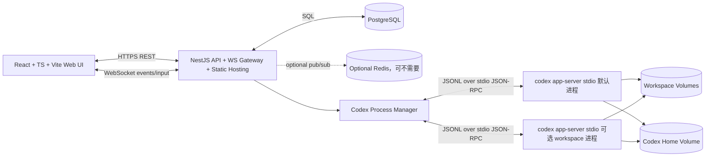

# CodexWebUI 架构方案：基于 Codex App Server 的 Docker 化 Web 客户端

## 1. 结论摘要

建议采用：

```text
React + TypeScript + Vite 前端
        ↓ HTTPS / WebSocket
NestJS 单体后端：API + WebSocket Gateway + 静态资源承载
        ↓ stdio JSON-RPC bridge，优先
codex app-server 子进程，必要时按 workspace 拆分
        ↓ Codex 本地配置、工作区、会话 JSONL、OpenAI/ChatGPT Auth
PostgreSQL：个人工作区元数据、事件索引、UI 投影、审计
```

核心判断：

- **Codex App Server 应作为 agent 会话交互面**：会话、turn、流式事件、审批、模型列表、账号、MCP、skills、apps 等能力优先通过 app-server JSON-RPC 暴露；但通用文件管理和全局 Web 终端由 NestJS 自建，更符合个人 Docker WebUI 的产品形态。
- **JSONL 不建议作为常规业务读模型**：它是 Codex 的持久化 rollout/session 载体，适合备份、导入、审计、故障恢复或离线修复；日常 UI 查询应优先调用 `thread/list`、`thread/read`、`thread/turns/list` 等 app-server API。
- **需要 normalize 层**：不是为了把 JSONL 和 app-server response 强行合并成一个“真相”，而是为了把 app-server 的请求响应、通知、server request、delta 流归一成前端稳定 ViewModel，并把关键事件落库形成可索引投影。
- **可以实现真流式打字机效果**：app-server 明确提供 `item/agentMessage/delta`、`item/plan/delta`、`item/reasoning/summaryTextDelta`、`item/commandExecution/outputDelta` 等增量通知；前端可按 `itemId` 顺序追加渲染。
- **Web 终端优先使用 `node-pty` 自建**：你的终端需要全局打开、可脱离具体 Codex 会话、默认 `~`、在会话页打开时继承该会话 `cwd`；这更接近 VS Code Terminal 产品模型，不应强绑定 app-server 的 `command/exec` 生命周期。
- **部署上优先 NestJS 承载 Vite dist**：个人使用场景下，一个 Web 容器暴露 HTTP/WebSocket，内部管理 Codex 子进程；PostgreSQL 独立容器；工作区目录和单一 Codex home 通过 volume 持久化。
- **不按多用户/多租户设计**：本方案默认只有一个操作者；鉴权采用环境变量 `WEBUI_API_KEY` 作为单实例访问密钥，不做用户表、RBAC、团队权限或复杂登录体系。

置信度：**高**。但需注意：app-server WebSocket transport 官方标注为 experimental/unsupported，因此服务器 Docker 部署不建议直接把 `codex app-server --listen ws://0.0.0.0:*` 暴露到公网。

## 2. 官方依据与约束

| 主题 | 已确认事实 | 架构影响 | 来源 |
|---|---|---|---|
| Codex App Server 协议 | app-server 使用省略 `jsonrpc: "2.0"` 字段的 JSON-RPC 2.0 消息；支持 `stdio`、实验性 `websocket`、`off` transport | NestJS 后端应实现 JSON-RPC client/bridge；默认优先 `stdio` 子进程 | [OpenAI Developers, 2026-05-09, Codex App Server / Protocol, https://developers.openai.com/codex/app-server] |
| App Server WebSocket | WebSocket transport 是 experimental and unsupported；非 loopback 默认 rollout 阶段可能允许未认证连接，远程暴露前必须配置 auth | 不建议公网直连 app-server WebSocket；应由 NestJS 做鉴权代理 | [OpenAI Developers, 2026-05-09, Codex App Server / Protocol, https://developers.openai.com/codex/app-server] |
| App Server schema | CLI 可生成 TypeScript schema 或 JSON Schema：`codex app-server generate-ts --out ./schemas` | 后端应把 schema 生成物纳入构建，锁定 Codex 版本，降低协议漂移风险 | [OpenAI Developers, 2026-05-09, Codex App Server / Message schema, https://developers.openai.com/codex/app-server] |
| 线程与 turn | Thread 是对话，Turn 是单次用户请求及 agent 工作，Item 是输入/输出/工具/文件变更等单位 | 前端状态模型应围绕 `Thread → Turn → Item → Delta` 设计 | [OpenAI Developers, 2026-05-09, Codex App Server / Core primitives, https://developers.openai.com/codex/app-server] |
| 流式事件 | `item/agentMessage/delta`、`item/commandExecution/outputDelta` 等通知提供增量输出；`item/completed` 是权威最终状态 | 支持打字机效果，但最终内容要以 `item/completed` 校准 | [OpenAI Developers, 2026-05-09, Codex App Server / Item deltas, https://developers.openai.com/codex/app-server] |
| 文件系统 API | app-server 提供 `fs/readFile`、`fs/writeFile`、`fs/readDirectory`、`fs/watch`、`fs/changed` 等 v2 文件系统 API，使用绝对路径 | 这些 API 可作为 Codex 会话内文件操作参考；通用 Web 文件管理建议由 NestJS 自建，以获得更稳定、可控、全局的文件浏览/编辑体验 | [OpenAI Developers, 2026-05-09, Codex App Server / Filesystem, https://developers.openai.com/codex/app-server] |
| 命令执行 | `command/exec` 可设置 `tty: true`、`streamStdoutStderr: true`，并支持 write/resize/terminate | 适合展示 Codex 会话内命令执行项；不作为全局 Web 终端主方案 | [OpenAI Developers, 2026-05-09, Codex App Server / Command execution, https://developers.openai.com/codex/app-server] |
| NestJS 静态资源 | `@nestjs/serve-static` 的 `ServeStaticModule` 可服务静态文件或 SPA | NestJS 可直接承载 Vite build 后的 `dist` | [NestJS, 2026-05-09, Serve Static recipe, https://docs.nestjs.com/recipes/serve-static] |
| Vite 构建 | `vite build` 生成生产包，默认输出目录是 `dist` | 前端构建产物复制进 NestJS 运行镜像并由 `ServeStaticModule` 服务 | [Vite, 2026-05-09, Building for Production, https://vite.dev/guide/build]；[Vite, 2026-05-09, Build Options / outDir, https://vite.dev/config/build-options] |
| node-pty | `node-pty` 提供 Node.js pseudoterminal 能力，但有 native build 依赖、平台差异和线程安全限制 | 作为全局 Web Terminal 主方案；Docker 镜像需包含编译依赖或固定预构建兼容版本 | [Microsoft, 2026-05-09, node-pty README, https://github.com/microsoft/node-pty] |
| Docker Node | 官方 Docker Node 指南支持多阶段构建与 Compose 部署；生产镜像应控制依赖与运行用户 | 使用多阶段 Dockerfile，PostgreSQL 独立服务，volume 持久化工作区和 Codex home | [Docker, 2026-05-09, Containerize a Node.js application, https://docs.docker.com/guides/nodejs/containerize/] |


## 2.1 本机 Codex CLI 验证记录

本环境已做轻量 smoke test，结果如下：

```text
codex --version
→ codex-cli 0.149.0

codex app-server --help
→ 支持 --listen stdio://、ws://IP:PORT、off
→ 支持 --ws-auth capability-token / signed-bearer-token
→ 支持 generate-ts 与 generate-json-schema 子命令

codex app-server generate-ts --out <tmp>/ts
codex app-server generate-json-schema --out <tmp>/json
→ 成功生成协议类型与 JSON Schema
→ 生成物包含 JSONRPCMessage、ClientRequest、ServerNotification、AgentMessageDeltaNotification、CommandExec*、FileChangeRequestApproval* 等 schema
```

对架构的影响：

- 当前机器可以直接采用 `spawn("codex", ["app-server"])` 的 stdio bridge 方案。
- 当前 CLI 已支持 schema 生成，后端项目应把生成物纳入构建或版本锁定流程。
- `--listen ws://IP:PORT` 与 WebSocket auth flags 在本机 CLI 中存在，但仍按官方文档标注为 experimental/unsupported，不建议浏览器公网直连。

## 3. 总体架构



### 3.1 进程边界

推荐把系统拆成 4 个逻辑边界：

1. **Web UI**：React/Vite，仅处理 UI 状态、编辑器、终端渲染、审批弹窗、会话列表。
2. **NestJS Host**：认证、租户/用户、项目权限、WebSocket fan-out、Codex JSON-RPC bridge、PostgreSQL 持久化、静态资源服务。
3. **Codex Runtime**：由 NestJS 拉起或连接的 `codex app-server`，负责真实 agent 协议、会话、工具、文件系统、审批、登录、模型和插件能力。
4. **Persistence**：PostgreSQL 存个人工作区元数据和 UI 投影；Codex 自己的 session JSONL 和配置目录由 volume 持久化。

### 3.2 推荐 transport

优先级：

```text
1. NestJS spawn('codex', ['app-server'])，使用 stdio JSONL transport
2. NestJS 连接 127.0.0.1 loopback app-server WebSocket，仅用于本机/sidecar 内部连接
3. 不建议：浏览器直接连接 app-server WebSocket
```

原因：

- `stdio` 是默认 transport，安全边界清晰，NestJS 可以完全控制访问入口、限流、审计和本机暴露范围。
- app-server WebSocket 官方标注为 experimental/unsupported；它适合 localhost 或 SSH port-forwarding，不适合作为公网应用协议直接暴露。
- 如果未来 app-server WebSocket 稳定，可以把 Codex bridge 抽象保留为 `CodexTransport` 接口，底层从 stdio 切换为 ws，不影响上层业务。

## 4. 后端模块设计：NestJS

```text
codex-webui/
  src/                     # NestJS 后端
    main.ts
    app.module.ts
    config/
    auth/                  # 个人部署可选：本地密码、反代鉴权或关闭公网访问
    workspaces/
    codex/
      codex.module.ts
      codex-process-manager.service.ts
      codex-jsonrpc-client.ts
      codex-session-registry.service.ts
      codex-normalizer.service.ts
      codex-event-store.service.ts
      codex-schema/
    threads/
      threads.controller.ts
      threads.gateway.ts
      threads.service.ts
    files/
      files.controller.ts
      files.gateway.ts
    terminal/
      terminal.gateway.ts
      terminal.service.ts
    approvals/
      approvals.gateway.ts
      approvals.service.ts
  web/                     # React + Vite 前端（独立 package.json）
    src/
    public/
    package.json
    vite.config.ts
  public/                  # web/ 构建产物输出目录，NestJS ServeStaticModule 托管
  package.json             # NestJS 后端 package.json
```

### 4.1 CodexProcessManager

职责：

- 按个人工作区或线程维度管理 `codex app-server` 进程。
- 注入环境变量：`CODEX_HOME`、`OPENAI_API_KEY` 或 ChatGPT 登录态、工作区路径白名单。
- 维护 JSON-RPC request id、pending promise、超时、重试、进程退出恢复。
- 监听 stdout 每行 JSON，区分 response、notification、server-initiated request。

建议策略：

```text
MVP：全局一个 app-server 进程，适合个人单工作区
增强：每个 workspace 一个 app-server 进程，避免 cwd/状态混杂
高安全模式：每个 workspace 独立容器或独立 Unix user
```

### 4.2 CodexJsonRpcClient

封装 app-server JSON-RPC：

```ts
interface CodexJsonRpcClient {
  initialize(clientInfo: ClientInfo, experimentalApi?: boolean): Promise<InitializeResult>;
  request<T>(method: string, params?: unknown, options?: RequestOptions): Promise<T>;
  notify(method: string, params?: unknown): void;
  onNotification(handler: (message: CodexNotification) => void): void;
  onServerRequest(handler: (request: CodexServerRequest) => Promise<unknown>): void;
}
```

初始化流程固定为：

```json
{ "method": "initialize", "id": 0, "params": { "clientInfo": { "name": "codex_webui", "title": "Codex WebUI", "version": "0.1.0" }, "capabilities": { "experimentalApi": true } } }
```

随后发送：

```json
{ "method": "initialized", "params": {} }
```

是否默认开启 `experimentalApi`：

- MVP 可开启，因为你希望尽量支持 app-server 模式下能力，包括 `thread/backgroundTerminals/clean`、collaboration mode、部分 apps/MCP 能力。
- 生产要在 UI 标记实验性功能，并支持按功能开关关闭。

### 4.3 ThreadsService

核心 API 映射：

| Web API | App Server API | 说明 |
|---|---|---|
| `POST /api/threads` | `thread/start` | 新建对话，传 `model`、`cwd`、`approvalPolicy`、`sandboxPolicy` |
| `GET /api/threads` | `thread/list` | 列表分页，PG 可叠加用户收藏/标签/权限 |
| `GET /api/threads/:id` | `thread/read` | 读取已存会话，可设置 `includeTurns` |
| `POST /api/threads/:id/resume` | `thread/resume` | 恢复并订阅事件 |
| `POST /api/threads/:id/fork` | `thread/fork` | 分叉历史 |
| `POST /api/threads/:id/branches` | `thread/fork` + 本地 SQLite | 消息级分支版本 |
| `GET /api/threads/:id/branch-state` | 本地 SQLite | 分支树 guard 状态 |
| `GET /api/threads/:id/branch-tree` | 本地 SQLite | 读取本地分支树 |
| `POST /api/threads/:id/archive` | `thread/archive` | 归档 |
| `POST /api/threads/:id/unarchive` | `thread/unarchive` | 取消归档 |
| `POST /api/threads/:id/turns` | `turn/start` | 用户发送消息 |
| `POST /api/threads/:id/turns/:turnId/steer` | `turn/steer` | turn 进行中追加输入 |
| `POST /api/threads/:id/turns/:turnId/interrupt` | `turn/interrupt` | 中断 |
| `POST /api/threads/:id/compact` | `thread/compact/start` | 压缩上下文 |

### 4.4 AuthService：单 API Key 门禁

本项目不设计多用户系统。后端通过环境变量配置一个单实例访问密钥：

```bash
WEBUI_API_KEY=your-long-random-secret
```

推荐鉴权策略：

```text
1. 前端登录页输入 API key。
2. POST /api/auth/login 校验 WEBUI_API_KEY。
3. 校验成功后后端签发短期 JWT，前端保存 JWT。
4. 后续 REST 请求使用 Authorization: Bearer <jwt>。
5. WebSocket handshake 也必须携带同一个 JWT。
```

MVP 也可以直接把 `WEBUI_API_KEY` 当 Bearer token 使用，但更推荐登录后签发 JWT，因为这样可以设置过期时间、实现 logout，并减少主密钥在后续请求中反复传输。

鉴权边界：

| 入口 | 是否必须鉴权 | 说明 |
|---|---:|---|
| `/api/**` | 是 | 包括 Codex thread、文件、终端、配置状态 |
| WebSocket Gateway | 是 | handshake 阶段校验，后续事件不再信任前端声明 |
| 静态资源 | 否或可选 | 登录页和前端 bundle 可公开；API/WS 必须鉴权 |
| `/api/docs` / OpenAPI JSON | 建议是 | 统一走同一套门禁；本地开发可关闭鉴权 |

不需要：用户表、注册、密码找回、OAuth、RBAC、租户、团队权限。

### 4.5 FilesService

通用文件管理建议由 NestJS 自建，而不是优先调用 app-server `fs/*`。原因是你的文件管理是 WebUI 的基础能力，不应依赖某个 Codex thread 是否 loaded，也不应被 app-server 的会话生命周期、实验字段或 Codex 内部语义牵制。

自建 FilesService 职责：

- `readDirectory`：读取文件树，支持隐藏文件、排序、分页或懒加载。
- `readFile`：读取文本文件，自动检测编码、大小限制和二进制类型。
- `writeFile`：保存编辑器内容，支持可选备份、mtime 冲突检测。
- `stat/getMetadata`：文件大小、mtime、权限、类型。
- `createDirectory/remove/rename/copy/move`：基础文件管理操作。
- `watch`：用 `chokidar` 或 Node `fs.watch` 做变更通知，再通过 NestJS WS 推前端。

app-server `fs/*` 的定位：

```text
Codex 会话内文件操作参考 / 兼容官方客户端能力 / 必要时做结果比对
```

自建 FS 与 app-server FS 的区别：

| 维度 | 自建 NestJS FilesService | app-server fs/* |
|---|---|---|
| 生命周期 | 全局可用，不依赖 thread loaded | 更贴近 Codex runtime 和会话上下文 |
| 产品控制 | 路由、缓存、分页、权限、预览策略完全可控 | 受 app-server 协议约束 |
| 文件管理体验 | 更适合做 IDE/sidebar 文件树 | 更适合 Codex 自身文件操作桥接 |
| 安全边界 | 你自己做 workspace root 白名单和 realpath 校验 | 借助 app-server 语义，但仍需上层鉴权 |
| 稳定性 | 普通 Node/Nest 能力，长期稳定 | 跟随 Codex app-server 协议演进 |

文件查看策略：

```text
文本：Monaco Editor / CodeMirror 6
Diff：Monaco Diff Editor 或 react-diff-view
图片：浏览器原生预览，路径由后端授权后读取/转发
大文件：默认只读前 N MB，提供下载或分页读取
二进制：只展示 metadata，避免误读和内存爆炸
```

安全底线：所有路径必须先解析到真实路径，再确认位于允许的 workspace roots 内；不要允许前端传入任意绝对路径后直接读取。

### 4.6 TerminalService

全局 Web Terminal 建议使用 `node-pty + xterm.js` 自建，不优先使用 app-server `command/exec` PTY。你的产品需求是：

- 终端可以全局打开，不一定属于某个 Codex thread 页面。
- 在会话页面打开时，默认 `cwd` 使用该会话的 `cwd`。
- 从全局入口打开时，默认 `cwd` 使用用户 home，例如 `/root`、`/home/codex` 或容器内配置的 `DEFAULT_TERMINAL_CWD`。
- 终端是用户主动打开的自由 shell，风险通过 Docker/访问控制/首次提示承担。
- 终端 session 生命周期由 WebUI 管理，而不是跟随某个 Codex turn 或 item。

推荐链路：

```text
xterm.js
  ⇅ NestJS WebSocket Gateway
TerminalService
  ⇅ node-pty
bash / zsh / sh
```

后端接口建议：

```text
client → server:
  terminal.open     { cwd?, shell?, cols, rows, source?: 'global' | 'thread', threadId? }
  terminal.input    { terminalId, data }
  terminal.resize   { terminalId, cols, rows }
  terminal.close    { terminalId }

server → client:
  terminal.opened   { terminalId, cwd, shell }
  terminal.output   { terminalId, data }
  terminal.exited   { terminalId, exitCode, signal }
  terminal.error    { terminalId?, message }
```

`cwd` 选择规则：

```text
1. 如果从 thread 页面打开，优先使用 thread.cwd / lastTurn.cwd / workspace root。
2. 如果从全局入口打开，使用 DEFAULT_TERMINAL_CWD。
3. 如果未配置 DEFAULT_TERMINAL_CWD，使用容器内 HOME。
4. 所有 cwd 必须经过 realpath 校验；默认建议限制在 workspace roots 或显式允许的 roots。
```

风险提示策略：

- 第一次打开终端时展示明确风险提示：这是服务器 shell，命令会真实执行。
- 个人 Docker 部署可把 Docker 容器视作主要 sandbox，但仍要避免把宿主机敏感目录挂进去。
- 实机部署时风险更高，必须提示“终端等同于在服务器上执行命令”。
- 可提供设置项：是否允许终端访问 workspace root 外路径。

`node-pty` 与 app-server `command/exec` 的分工：

| 能力 | 用 `node-pty` | 用 app-server `command/exec` |
|---|---|---|
| 全局终端 | 是，主方案 | 否 |
| 会话页默认 cwd 终端 | 是，打开时传入 thread cwd | 可行但不推荐作为主终端 |
| Codex agent 执行命令展示 | 否，使用 app-server item 事件 | 是 |
| 命令审批流 | 自建风险提示/配置 | Codex app-server 自带审批语义 |
| 多 terminal tab | 是，WebUI 自己管理 | 不适合作为主抽象 |
| Docker native 依赖 | 需要处理 `node-pty` 构建 | 不需要 NestJS 装 `node-pty` |

结论：`node-pty` 是用户终端；app-server `command/exec` 是 Codex/agent 命令执行通道。两者都可以显示在前端，但不应混为一个抽象。

### 4.7 CodexStatusService：账号态与运行可用态分离

个人部署时，不能把 `account/read` 的结果直接等同于“Codex 是否可用”。你的常见模式是：不登录 ChatGPT/Codex 账号，而是在 `config.toml` 中配置 `model_provider` 与 `env_key`，实际 API key 从容器环境变量读取。这种情况下 `account/read` 可能返回 `account: null`，但运行时仍然完全可用。

因此后端应拆成两层状态：

```text
Account Status：Codex/ChatGPT 账号登录态
Runtime Readiness：当前 config.toml + env_key + model/provider 是否真的可运行
```

推荐启动检查流程：

```text
NestJS 启动
  → spawn codex app-server
  → initialize / initialized
  → account/read
  → config/read
  → model/list
  → 可选：thread/start + 极轻量 turn/start smoke test
```

状态判断规则：

| 条件 | UI 展示 | 是否可继续 |
|---|---|---:|
| `account.type = "chatgpt"` | ChatGPT 已登录 | 是 |
| `account.type = "apiKey"` | Codex API Key 登录 | 是 |
| `account = null` 且 `requiresOpenaiAuth = false` | 无需账号登录，使用 provider/env 配置 | 是，继续检查 provider |
| `account = null` 且 `requiresOpenaiAuth = true` | 需要登录或配置 API key | 否，除非 provider/env 可覆盖 |
| `config.model_provider` 存在且对应 `env_key` 环境变量存在 | Provider 凭据存在 | 是，继续 `model/list` |
| `env_key` 缺失或环境变量为空 | Provider key 缺失 | 否 |
| `model/list` 成功 | 模型目录可读 | 是 |
| `model/list` 失败 | Provider/API 不可用或配置错误 | 否 |

建议后端聚合类型：

```ts
type CodexAuthMode =
  | 'chatgpt'
  | 'apiKeyLogin'
  | 'externalProviderEnv'
  | 'noAuthRequired'
  | 'unknown';

type CodexRuntimeStatus =
  | 'ready'
  | 'missingEnvKey'
  | 'missingProviderConfig'
  | 'accountLoginRequired'
  | 'modelListFailed'
  | 'turnSmokeTestFailed'
  | 'appServerUnavailable';
```

推荐暴露聚合接口：

```http
GET /api/codex/status
```

返回示例：

```json
{
  "appServer": "ready",
  "account": {
    "mode": "noAuthRequired",
    "requiresOpenaiAuth": false
  },
  "provider": {
    "id": "openai",
    "envKey": "OPENAI_API_KEY",
    "envPresent": true
  },
  "models": {
    "listable": true,
    "defaultModel": "gpt-5.4"
  },
  "runtime": "ready"
}
```

安全要求：接口只能返回环境变量名与是否存在，不能返回 key 值；`config/read` 的完整结果也不应原样透传给前端，应由后端脱敏和裁剪。

## 4.8 OpenAPI、Swagger 与前端 SDK 生成

建议后端加入 Swagger/OpenAPI。原因不是为了给多人开放 API，而是为了让前端可以从 OpenAPI schema 自动生成类型安全 SDK，减少手写 fetch 与类型漂移。

后端选型：

```bash
npm install @nestjs/swagger
```

NestJS 中使用 `SwaggerModule` 与 `DocumentBuilder` 生成 OpenAPI 文档；文档路由建议：

```text
GET /api/docs       Swagger UI，开发环境默认开启
GET /api/openapi.json  OpenAPI JSON，供 SDK 生成使用
```

生产建议：

- `/api/docs` 可通过 `ENABLE_SWAGGER=true` 控制是否启用。
- `/api/openapi.json` 可以保留，但仍走 `WEBUI_API_KEY` / JWT 鉴权。
- Controller 和 DTO 使用 `@nestjs/swagger` decorators 或 Nest Swagger plugin 保证 schema 完整。

前端 SDK 生成建议使用 Hey API：

```bash
npm install -D @hey-api/openapi-ts
npm install @tanstack/react-query
```

`openapi-ts.config.ts` 示例：

```ts
export default {
  input: 'http://localhost:3000/api/openapi.json',
  output: 'src/shared/api/generated',
  plugins: [
    '@hey-api/client-fetch',
    {
      name: '@tanstack/react-query',
      queryOptions: true,
      mutationOptions: true,
      queryKeys: { tags: true },
    },
  ],
};
```

这里你记得的 TanStack 配合包就是 Hey API 的 `@tanstack/react-query` 插件。它会基于 OpenAPI 生成 TanStack Query v5 可用的 query options、mutation options 和 query keys；前端继续使用 `@tanstack/react-query` 管理服务端状态。

推荐分工：

| 类型 | 方案 | 说明 |
|---|---|---|
| 普通 REST API | Hey API 生成 SDK + TanStack Query | workspaces、threads list、files metadata、codex status |
| WebSocket 实时事件 | 手写 typed client | app-server delta、terminal output、fs changed 不适合纯 OpenAPI |
| 大文件下载/上传 | 手写或单独封装 | 避免生成 SDK 抽象影响流式/进度控制 |
| Terminal input/output | 手写 WS client | 低延迟双向流，不走 REST SDK |

官方依据：NestJS 官方 OpenAPI 文档使用 `@nestjs/swagger`、`SwaggerModule`、`DocumentBuilder`；Hey API 官方文档使用 `@hey-api/openapi-ts`，并提供 `@tanstack/react-query` 插件生成 TanStack Query 集成。

## 5. 前端架构：React + TypeScript + Vite

### 5.1 推荐技术栈

| 能力 | 技术选型 | 理由 |
|---|---|---|
| 构建 | Vite + React + TS | 快速开发，生产输出 `dist`，易被 NestJS 承载 |
| UI | shadcn/ui + Radix UI + Tailwind CSS | 适合构建复杂控制台 UI，组件可控 |
| 状态 | Zustand + TanStack Query | Query 管服务端状态，Zustand 管实时 UI 状态 |
| REST SDK | Hey API `@hey-api/openapi-ts` + `@tanstack/react-query` 插件 | 从 NestJS OpenAPI 自动生成类型安全 SDK、query options 和 mutation options |
| i18n | react-i18next + i18next-browser-languagedetector + i18next-http-backend | 命名空间按模块拆分翻译文件并懒加载，插件生态成熟，bundle 小（core ~6KB），API 简洁（`useTranslation` hook） |
| 编辑器 | Monaco Editor | 文件查看、diff、代码高亮成熟 |
| 终端 | xterm.js + xterm-addon-fit | Web PTY 标准方案 |
| WebSocket | 原生 WebSocket 或 socket.io-client | 如果后端用 Nest Gateway/socket.io，则用 socket.io-client；否则原生 WS 更轻 |
| Markdown | react-markdown + rehype-highlight/shiki | 渲染 agent answer 与计划 |
| 虚拟列表 | TanStack Virtual | 长会话、多 item 输出性能 |

### 5.2 页面结构

```text
/login
/workspaces
/workspaces/:workspaceId/threads
/workspaces/:workspaceId/threads/:threadId
  ├─ 左侧：thread list、workspace file tree
  ├─ 中间：conversation timeline
  ├─ 右侧：file viewer / diff / terminal / approvals
  └─ 底部：composer，支持 text/image/localImage/skill/app mention
/settings
  ├─ account/auth
  ├─ models
  ├─ MCP servers
  ├─ apps/connectors
  ├─ skills/plugins
  └─ sandbox/approval policy
```

### 5.3 实时状态模型

```ts
type ThreadView = {
  id: string;
  name?: string | null;
  status: 'notLoaded' | 'idle' | 'systemError' | 'active';
  turns: Record<string, TurnView>;
  orderedTurnIds: string[];
  pendingApprovals: ApprovalView[];
};

type TurnView = {
  id: string;
  status: 'inProgress' | 'completed' | 'interrupted' | 'failed';
  items: Record<string, ItemView>;
  orderedItemIds: string[];
  diff?: string;
  plan?: PlanStep[];
};

type ItemView =
  | AgentMessageItem
  | CommandExecutionItem
  | FileChangeItem
  | ReasoningItem
  | McpToolCallItem
  | WebSearchItem
  | GenericUnknownItem;
```

## 6. App Server response 与 Codex session JSONL 的关系

### 6.1 两者定位不同

```text
App Server response / notification：在线协议层与实时状态流
Codex session JSONL：Codex 本地持久化 rollout/session 日志
PostgreSQL normalized event store：你的产品层事件索引和 UI 投影
```

### 6.2 App Server response 更适合作为 UI 数据源

app-server response/notification 包含：

- request/response：如 `thread/start`、`turn/start`、`thread/read`。
- lifecycle notification：如 `thread/started`、`turn/started`、`turn/completed`、`item/started`、`item/completed`。
- delta notification：如 `item/agentMessage/delta`、`item/commandExecution/outputDelta`。
- server-initiated request：如命令审批、文件变更审批、`tool/requestUserInput`、外部 token refresh。
- runtime-only state：如 loaded thread status、active flags、正在等待审批、实时 token usage、进程级错误。

这些内容天然服务 UI，而且 app-server 文档明确指出：`item/completed` 应作为 item 最终权威状态；`turn/diff/updated` 和 `turn/plan/updated` 里即使包含空 items，也应以 `item/*` 通知作为 turn items 的 source of truth。

### 6.3 JSONL 更适合作为 Codex 内部持久化和恢复层

从官方页面可确认：

- `thread/archive` 会移动持久化 JSONL log 到 archived sessions 目录。
- 消息级分支使用 `thread/fork(beforeTurnId)`，分叉边界由 WebUI SQLite 记录；不再使用废弃的 rollback 路径。
- `thread/inject_items` 会把 raw Responses API items append 到 loaded thread 的 model-visible history，并持久化到 rollout。
- `thread/read`、`thread/list`、`thread/turns/list` 可以读取存储过的 thread 和 turn 历史，而不必让你的应用直接解析 JSONL。

因此，不建议把 JSONL 作为产品功能的一等数据库。直接解析 JSONL 的主要问题：

- Codex 内部格式可能随版本演进，兼容性不如 app-server schema 明确。
- JSONL 不一定包含所有实时 UI 所需的临时状态、审批请求、delta 流、连接状态。
- 你直接读 JSONL 可能绕过 app-server 的权限、归档、分支、resume 语义。
- 对个人 Web 控制台而言，直接暴露 JSONL 文件路径也有安全风险，尤其是服务可被公网访问时。

### 6.4 是否最终需要考虑 JSONL？

需要，但应限定在这些场景：

| 场景 | 是否读 JSONL | 原因 |
|---|---:|---|
| 会话列表、会话详情、turn 历史 | 否，优先 app-server API | 官方已有 `thread/list`、`thread/read`、`thread/turns/list` |
| 归档/恢复/回滚 | 否，优先 app-server API | 官方 API 会维护 JSONL 与运行时状态一致性 |
| UI 实时渲染 | 否 | JSONL 没有完整实时 delta 和 server request 生命周期 |
| 故障恢复后重建 PG 投影 | 可以 | app-server 不可用或 PG 投影损坏时，JSONL 可作为后备源 |
| 合规审计/离线备份 | 可以 | 但建议只由后台 job 读取，不直接给前端 |
| 跨版本迁移 | 谨慎 | 必须按 Codex 版本做 parser，并保留 raw backup |

结论：**需要为 JSONL 预留 import/reconcile 能力，但不要让核心产品依赖 JSONL parser。**

## 6.5 App-server 官方类型与事件处理面

当前本机验证的 `codex-cli 0.149.0` 支持直接生成 app-server 官方类型：

```bash
codex app-server generate-ts --out backend/src/codex/codex-schema
codex app-server generate-json-schema --out backend/codex-json-schema
```

本机 smoke test 结果：

```text
JSON Schema 文件数：221
Notification schema 数：60
包含：ClientRequest、ServerRequest、ServerNotification、AgentMessageDeltaNotification、ItemStartedNotification、ItemCompletedNotification、TurnStartedNotification、TurnCompletedNotification 等
```

实现上不要手写协议类型，应该把生成的 TypeScript 类型作为 Codex bridge 的输入类型来源；但业务层不要直接把官方类型暴露给前端，而是转换为 WebUI 自己的 normalized event。

### 6.5.1 三种消息不是一回事

| 类型 | app-server 形态 | WebUI 处理方式 |
|---|---|---|
| Request response | `{ id, result/error }` | resolve/reject 后端 pending promise |
| Notification | `{ method, params }` | 进入 normalizer，推送前端，必要时落库 |
| Server request | `{ id, method, params }` | 后端或前端必须返回 response，例如审批、用户输入、token refresh |

### 6.5.2 MVP 必须处理的事件组

| 事件组 | 代表事件 | UI 含义 | MVP 处理 |
|---|---|---|---|
| Thread lifecycle | `thread/started`、`thread/status/changed`、`thread/closed`、`thread/archived`、`thread/unarchived` | 会话加载、关闭、归档、活跃状态 | 必须 |
| Turn lifecycle | `turn/started`、`turn/completed` | 一轮问答开始/完成/失败/中断 | 必须 |
| Item lifecycle | `item/started`、`item/completed` | 用户消息、AI 消息、命令、文件变更、工具调用等 item 的最终状态 | 必须 |
| AI 流式回答 | `item/agentMessage/delta` | 打字机效果 | 必须 |
| Plan | `turn/plan/updated`、`item/plan/delta` | agent 计划更新 | 建议 MVP 支持 |
| Diff | `turn/diff/updated`、`item/fileChange/outputDelta`、`fileChange/patchUpdated` | 本轮代码改动、patch 输出 | 建议 MVP 支持 |
| Command output | `item/commandExecution/outputDelta` | Codex agent 执行命令的输出，不是用户全局 terminal | 必须区分 |
| Approval/server request | `item/commandExecution/requestApproval`、`item/fileChange/requestApproval`、`serverRequest/resolved` | 命令/文件变更审批 | 如果启用审批则必须 |
| Error/warning | `error`、`warning`、`configWarning`、`deprecationNotice` | 失败、配置问题、兼容性提醒 | 必须 |
| Token usage | `thread/tokenUsage/updated` | 用量展示 | 可选 |
| Skills/apps/MCP status | `skills/changed`、`app/list/updated`、`mcpServerStatus/updated`、`mcpToolCall/progress` | 插件、skills、MCP 状态变化 | Phase 2/3 |
| Filesystem notify | `fs/changed` | app-server FS watch 变化 | 若文件管理自建，可不作为主链路 |
| Auth/account | `account/updated`、`account/login/completed`、`account/rateLimits/updated` | ChatGPT 登录态与额度 | 可选，状态页支持即可 |
| Auto compact | `contextCompaction` item、`contextCompacted` legacy notification | 上下文压缩发生 | 建议显示为系统事件 |
| Realtime/audio | `threadRealtime*`、audio/transcript delta | 语音/实时能力 | 暂不做 |
| Windows sandbox | `windowsSandbox/setupCompleted`、`windowsWorldWritableWarning` | Windows 特定沙箱 | Linux Docker 可忽略 |

### 6.5.3 用户消息、AI 消息、function call 分别在哪

| 你关心的东西 | app-server 里通常怎么看 | 前端表现 |
|---|---|---|
| 用户消息 | `item/started` / `item/completed`，`item.type = userMessage` | timeline 中的一条用户气泡 |
| AI 流式回答 | `item/agentMessage/delta`，最终 `item/completed` 的 `agentMessage` | assistant 气泡打字机，最终校准 |
| Reasoning summary | `item/reasoning/summaryTextDelta`、`summaryPartAdded`、`item/completed` reasoning | 可折叠“思考摘要”区域 |
| Function/tool call | `mcpToolCall`、`dynamicToolCall`、`collabToolCall`、`webSearch` 等 item 类型 | 工具调用卡片 |
| 命令执行 | `commandExecution` item + output delta | 命令卡片，不等同于 node-pty 用户终端 |
| 文件修改 | `fileChange` item + diff/patch delta | 文件变更卡片与 diff 面板 |
| 自动压缩 | `contextCompaction` item 或 legacy `contextCompacted` | 系统事件：“上下文已压缩” |
| 报错 | JSON-RPC error、`error` notification、`turn/completed.status = failed` | toast + turn 错误状态 |

### 6.5.4 不要一开始试图完整支持 60 个 notification

建议 reducer 设计成“强类型核心事件 + unknown fallback”：

```ts
type WebuiCodexEvent =
  | { type: 'thread.started'; payload: ThreadView }
  | { type: 'turn.started'; payload: TurnView }
  | { type: 'turn.completed'; payload: TurnView }
  | { type: 'item.started'; payload: ItemView }
  | { type: 'item.delta'; itemId: string; deltaKind: string; text?: string; payload: unknown }
  | { type: 'item.completed'; payload: ItemView }
  | { type: 'approval.requested'; payload: ApprovalView }
  | { type: 'server.error'; payload: unknown }
  | { type: 'unknown'; method: string; payload: unknown };
```

MVP 只要保证：问答、流式回答、用户消息、命令输出卡片、文件变更卡片、错误、审批、turn 完成状态可用即可。其他事件先记录 raw message，并在 UI 里以 generic event 或 debug 面板展示。

## 7. Normalize 设计

### 7.1 为什么必须 normalize

app-server 的协议是事件化、增量化、版本演进的：

- response 与 notification 混合在同一连接中。
- 同一个 item 可能先 `item/started`，再收到多次 delta，最后 `item/completed`。
- 一些事件是 server request，需要前端/后端响应后 app-server 才继续。
- 实验性能力可能增加新 item type 或新字段。

所以需要一层归一化，不是为了“改写 Codex 语义”，而是为了稳定产品 UI 和数据库。

### 7.2 三层事件模型

```text
Layer 1 RawCodexEvent
  完整保存 app-server 原始 JSON message，用于审计、debug、重放。

Layer 2 NormalizedEvent
  归一成 thread、turn、item、delta、approval、fs、terminal、auth 等产品事件。

Layer 3 Projection
  面向 UI 的当前状态快照，如 thread list、turn timeline、pending approvals、terminal buffer metadata。
```

### 7.3 归一化规则

```ts
type RawCodexMessage = {
  id?: number | string;
  method?: string;
  params?: unknown;
  result?: unknown;
  error?: { code: number; message: string; data?: unknown };
};

type NormalizedEvent = {
  eventId: string;
  source: 'codex-app-server';
  connectionId: string;
  threadId?: string;
  turnId?: string;
  itemId?: string;
  type:
    | 'thread.started'
    | 'thread.status_changed'
    | 'turn.started'
    | 'turn.completed'
    | 'item.started'
    | 'item.delta'
    | 'item.completed'
    | 'approval.requested'
    | 'approval.resolved'
    | 'terminal.output'
    | 'fs.changed'
    | 'auth.updated'
    | 'unknown';
  payload: unknown;
  rawMessageId?: string | number;
  occurredAt: string;
  schemaVersion: number;
};
```

关键规则：

- **Raw 永远保留**：未知事件不要丢弃，标记为 `unknown`。
- **delta 可即时渲染，但最终以 completed 校准**：例如 agent text 先拼 delta，收到 `item/completed` 后替换为最终 `item.text`。
- **按 connection sequence 排序**：同一 app-server 连接内 stdout line/frame 顺序是事件顺序；落库时增加 `sequence_no`。
- **server request 必须显式跟踪**：审批类请求应产生 `approval.requested`，响应后用 `serverRequest/resolved` 或 request response 生成 `approval.resolved`。
- **版本字段必须存在**：`schemaVersion` 和 `codexVersion` 用于后续迁移。

## 8. PostgreSQL 数据模型

### 8.1 推荐表

```sql
create table workspace (
  id uuid primary key,
  name text not null,
  root_path text not null,
  codex_home_path text not null,
  is_default boolean not null default false,
  created_at timestamptz not null default now(),
  archived_at timestamptz
);

create table codex_thread_index (
  id text primary key,
  workspace_id uuid not null references workspace(id),
  name text,
  preview text,
  model_provider text,
  cwd text,
  status jsonb,
  archived boolean not null default false,
  created_at timestamptz,
  updated_at timestamptz,
  last_synced_at timestamptz not null default now()
);

create table codex_raw_event (
  id bigserial primary key,
  workspace_id uuid not null references workspace(id),
  thread_id text,
  turn_id text,
  item_id text,
  connection_id uuid not null,
  sequence_no bigint not null,
  direction text not null check (direction in ('inbound','outbound')),
  method text,
  request_id text,
  payload jsonb not null,
  codex_version text,
  created_at timestamptz not null default now(),
  unique(connection_id, sequence_no)
);

create table codex_normalized_event (
  id uuid primary key,
  raw_event_id bigint references codex_raw_event(id),
  workspace_id uuid not null references workspace(id),
  thread_id text,
  turn_id text,
  item_id text,
  type text not null,
  payload jsonb not null,
  schema_version int not null,
  occurred_at timestamptz not null,
  created_at timestamptz not null default now()
);

create table codex_turn_projection (
  thread_id text not null,
  turn_id text not null,
  workspace_id uuid not null references workspace(id),
  status text not null,
  items jsonb not null default '[]'::jsonb,
  plan jsonb,
  diff text,
  error jsonb,
  started_at timestamptz,
  completed_at timestamptz,
  updated_at timestamptz not null default now(),
  primary key(thread_id, turn_id)
);

create table codex_pending_request (
  id uuid primary key,
  workspace_id uuid not null references workspace(id),
  thread_id text,
  turn_id text,
  item_id text,
  request_id text not null,
  method text not null,
  payload jsonb not null,
  status text not null check (status in ('pending','accepted','declined','cancelled','expired','resolved')),
  created_at timestamptz not null default now(),
  resolved_at timestamptz
);
```

### 8.2 不建议存什么

不建议把完整文件内容、终端全量输出、模型原始长推理内容全部无差别塞入 PG：

- 终端输出只保留最近 buffer、命令摘要和审计必要信息；长日志放对象存储或压缩归档。
- 文件内容实时读取，不做永久复制，除非用户显式保存快照。
- reasoning 原文可能敏感，默认只存 summary 或按配置关闭持久化。

## 9. Docker 部署方案

### 9.1 Compose 拓扑

```yaml
services:
  web:
    build: .
    ports:
      - "3000:3000"
    environment:
      NODE_ENV: production
      DATABASE_URL: postgres://codexwebui:codexwebui@db:5432/codexwebui
      CODEX_WEBUI_WORKSPACES_ROOT: /workspaces
      CODEX_HOME: /codex-home
    volumes:
      - workspaces:/workspaces
      - codex_home:/codex-home
    depends_on:
      db:
        condition: service_healthy
    restart: unless-stopped

  db:
    image: postgres:16-alpine
    environment:
      POSTGRES_DB: codexwebui
      POSTGRES_USER: codexwebui
      POSTGRES_PASSWORD: codexwebui
    volumes:
      - pg_data:/var/lib/postgresql/data
    healthcheck:
      test: ["CMD-SHELL", "pg_isready -U codexwebui -d codexwebui"]
      interval: 10s
      timeout: 5s
      retries: 5
    restart: unless-stopped

volumes:
  pg_data:
  workspaces:
  codex_home:
```

### 9.2 Dockerfile 方向

由于终端主方案使用 `node-pty`，镜像需要支持 native addon 构建。基础运行镜像可参考：

```dockerfile
FROM node:22-bookworm-slim AS frontend-builder
WORKDIR /app/web
COPY web/package*.json web/pnpm-lock.yaml* ./
RUN corepack enable && pnpm install --frozen-lockfile
COPY web ./
RUN pnpm build  # 输出到 ../public/

FROM node:22-bookworm-slim AS backend-builder
WORKDIR /app
COPY package*.json pnpm-lock.yaml* ./
RUN corepack enable && pnpm install --frozen-lockfile
COPY src ./src
COPY tsconfig*.json nest-cli.json ./
COPY --from=frontend-builder /app/public ./public
RUN pnpm build

FROM node:22-bookworm-slim AS runtime
WORKDIR /app
ENV NODE_ENV=production
RUN apt-get update \
  && apt-get install -y --no-install-recommends ca-certificates git bash ripgrep \
  && rm -rf /var/lib/apt/lists/*
COPY --from=backend-builder /app/package*.json /app/pnpm-lock.yaml* ./
COPY --from=backend-builder /app/node_modules ./node_modules
COPY --from=backend-builder /app/dist ./dist
COPY --from=backend-builder /app/public ./public
USER node
EXPOSE 3000
CMD ["node", "dist/main.js"]
```

`node-pty` 的 builder/runtime 需加入 native build 依赖：

```dockerfile
RUN apt-get update \
  && apt-get install -y --no-install-recommends python3 make g++ build-essential \
  && rm -rf /var/lib/apt/lists/*
```

同时应固定 Node major、node-pty 版本、CPU 架构，避免 native addon ABI 不匹配。

### 9.3 Codex CLI 安装

部署镜像内必须可执行：

```bash
codex app-server
codex app-server generate-ts --out ./schemas
```

建议在构建阶段或启动前做健康检查：

```bash
codex --version
codex app-server generate-json-schema --out /tmp/codex-schema-check
```

如果 Codex CLI 以 npm 包、二进制或发行包安装，需在 Dockerfile 中固定版本，并把生成 schema 纳入构建产物，避免运行时协议与编译类型不一致。

## 10. 安全与隔离

### 10.1 个人部署仍必须做的安全边界

- **禁止浏览器直连 app-server**：所有请求经 NestJS 代理；app-server 只作为本地子进程或 loopback 服务。
- **单 API key 门禁**：通过环境变量 `WEBUI_API_KEY` 配置单实例访问密钥；REST、WebSocket、文件管理、终端和 Codex API 全部校验该凭据。
- **workspace root 白名单**：只允许访问 `/workspaces` 下配置过的目录，所有 `cwd` 和 `fs path` 做 `realpath` 校验。
- **单一 `CODEX_HOME` 持久化**：个人部署可以共享一个 `/codex-home`，便于复用登录态、配置、skills、plugins 和 sessions。
- **sandbox policy 可视化**：UI 明确展示 `readOnly`、`workspaceWrite`、`dangerFullAccess`、network access。
- **审批不能静默接受**：即使个人使用，命令和文件变更审批也应保留弹窗、记录和手动确认。
- **终端访问控制**：Web terminal 不需要单独 RBAC，但必须复用 `WEBUI_API_KEY` 鉴权；首次打开终端展示“命令会在服务器/容器中真实执行”的确认提示。
- **secret 不入库明文**：OpenAI API key、ChatGPT external token、MCP token 至少使用本地加密或只放环境变量/volume 文件。

### 10.2 个人部署推荐隔离等级

| 等级 | 隔离方式 | 适用场景 |
|---|---|---|
| P1 | 单容器 + 单 `CODEX_HOME` + 单 workspace root | 个人本机或可信内网 MVP |
| P2 | 单容器 + 单 `CODEX_HOME` + 多 workspace 白名单 | 个人服务器长期使用，推荐起点 |
| P3 | 每 workspace 独立 app-server 进程 | 同时打开多个项目，避免 cwd/状态混杂 |
| P4 | 每 workspace 独立容器或 Unix user | 经常运行不可信仓库或暴露 Web terminal |

建议你的 Docker 服务器部署从 **P2** 起步；如果会拉取和运行不可信仓库，直接按 **P4** 设计。

## 11. 功能路线图

### Phase 1：MVP

- `WEBUI_API_KEY` 单实例登录门禁，REST 与 WebSocket 全部鉴权。
- NestJS Swagger/OpenAPI：`/api/docs` 与 `/api/openapi.json`。
- Hey API 生成前端 REST SDK，并接入 TanStack Query。
- `GET /api/codex/status`：区分账号登录态与 provider/env 运行可用态。
- workspace 创建和路径绑定。
- `codex app-server` stdio 进程管理。
- `initialize`、`model/list`、`thread/start`、`thread/list`、`thread/read`、`turn/start`、`turn/interrupt`。
- 基于 `item/agentMessage/delta` 的打字机效果。
- `item/started` / `item/completed` timeline。
- 自建 NestJS FilesService：文件树、文件查看、文件保存、watch。
- `node-pty` + xterm.js 全局 Web Terminal，支持从 thread cwd 或全局 home 打开。
- command/file approval UI。

### Phase 2：接近官方客户端体验

- `thread/resume`、`thread/fork`、`thread/archive`、`thread/unarchive`。
- `thread/compact/start`、消息级分支拓扑（`thread/fork(beforeTurnId)` + SQLite）。
- `turn/steer` 进行中追问。
- `turn/diff/updated` diff 面板。
- `turn/plan/updated` plan 面板。
- `thread/tokenUsage/updated` 用量显示。
- `skills/list`、`skills/config/write`、skill mention。
- `mcpServerStatus/list`、`mcpServer/tool/call` 可视化。

### Phase 3：高级 app-server 能力

- `app/list`、connector mention、apps 配置管理。
- plugin marketplace：`plugin/list`、`plugin/read`、`plugin/install`。
- `review/start` 代码审查模式。
- `account/read`、`account/login/start`、ChatGPT device code flow。
- `account/rateLimits/read` 额度展示。
- `config/read`、`config/batchWrite` 设置 UI。
- JSONL reconcile/import 后台任务。

## 12. 关键实现细节

### 12.1 NestJS 承载 Vite dist

NestJS 中使用：

```ts
import { Module } from '@nestjs/common';
import { ServeStaticModule } from '@nestjs/serve-static';
import { join } from 'node:path';

@Module({
  imports: [
    ServeStaticModule.forRoot({
      rootPath: join(__dirname, '..', 'public'),
      exclude: ['/api/(.*)', '/ws/(.*)'],
    }),
  ],
})
export class AppModule {}
```

Vite 构建产物输出到根目录 `public/`：

```bash
cd web
pnpm build   # vite.config.ts 中配置 outDir: '../public'
```

### 12.2 WebSocket 事件协议

浏览器不直接接收 app-server 原始事件，而是接收归一化事件：

```json
{
  "type": "item.delta",
  "threadId": "thr_123",
  "turnId": "turn_456",
  "itemId": "item_789",
  "deltaType": "agentMessage",
  "text": "新增文本片段",
  "sequenceNo": 1024
}
```

优势：

- 前端不被 app-server 协议变化直接冲击。
- 后端可做路径白名单和公网入口控制，避免误暴露本机文件与终端。
- 可以统一支持重连后补事件、快照恢复、审计。

### 12.3 重连策略

```text
Frontend reconnect
  → GET /api/threads/:id snapshot
  → WS subscribe(threadId, lastEventId)
  → Backend 从 PG normalized_event 补发缺失事件
  → 如果 app-server 线程未加载，则 thread/resume
```

如果 app-server 子进程重启：

```text
process exit
  → mark connection degraded
  → spawn new codex app-server
  → initialize
  → thread/resume for active threads
  → thread/read includeTurns rebuild projection if needed
```

### 12.4 schema 管理

构建时执行：

```bash
codex app-server generate-ts --out backend/src/codex/codex-schema
codex app-server generate-json-schema --out backend/codex-json-schema
```

运行时记录：

```text
codex_version
schema_generated_at
schema_git_sha_or_image_tag
```

如果升级 Codex CLI：

```text
1. 重新 generate-ts/json-schema
2. 跑协议兼容测试
3. 更新 normalizer unknown event fallback
4. 做 canary 部署
```

## 13. API 边界建议

### 13.1 REST API

```text
GET    /api/status
POST   /api/auth/login
POST   /api/auth/logout
GET    /api/openapi.json
GET    /api/codex/status
GET    /api/workspaces
POST   /api/workspaces
GET    /api/workspaces/:id/files?path=
GET    /api/workspaces/:id/file?path=

GET    /api/threads
POST   /api/threads
GET    /api/threads/:threadId
POST   /api/threads/:threadId/resume
POST   /api/threads/:threadId/fork
POST   /api/threads/:threadId/branches
GET    /api/threads/:threadId/branch-state
GET    /api/threads/:threadId/branch-tree
POST   /api/threads/:threadId/archive
POST   /api/threads/:threadId/unarchive
POST   /api/threads/:threadId/compact

POST   /api/threads/:threadId/turns
POST   /api/threads/:threadId/turns/:turnId/steer
POST   /api/threads/:threadId/turns/:turnId/interrupt

GET    /api/models
GET    /api/skills
GET    /api/apps
GET    /api/mcp-servers
GET    /api/account
```

### 13.2 WebSocket client events

```text
client → server:
  thread.subscribe
  thread.unsubscribe
  turn.start
  turn.steer
  turn.interrupt
  approval.respond
  terminal.open
  terminal.input
  terminal.resize
  terminal.close

server → client:
  thread.snapshot
  thread.status_changed
  turn.started
  turn.completed
  item.started
  item.delta
  item.completed
  approval.requested
  approval.resolved
  terminal.output
  fs.changed
  error
```

## 14. 风险清单

| 风险 | 影响 | 缓解 |
|---|---|---|
| app-server API 仍在演进 | 升级后字段或事件变化 | 使用官方 `generate-ts`，Raw event 保留，unknown fallback，Codex 版本锁定 |
| WebSocket transport experimental | 远程直连安全和稳定性不足 | NestJS 通过 stdio 代理，禁止公网直连 app-server |
| 终端误操作 | 用户在 Web terminal 中执行破坏性命令 | 首次打开明确提示命令会真实执行；Docker 部署避免挂载宿主机敏感目录 |
| JSONL parser 依赖内部格式 | 兼容性脆弱 | 核心功能不读 JSONL，仅做后台 reconcile/import |
| API/WS 鉴权遗漏 | 未登录即可访问终端、文件或 Codex API | 全局 NestJS Guard + WS handshake Guard，静态资源之外默认拒绝 |
| 大量 delta 写入 PG | 存储膨胀、性能下降 | raw event 分区/TTL，投影压缩，长输出对象存储 |
| node-pty native 依赖 | Docker 构建失败、跨架构问题 | 固定 Node/ABI/架构，Debian slim 镜像安装 python3/make/g++/build-essential |

## 15. 推荐的最小落地顺序

```text
1. 初始化项目结构：web/（React + Vite）+ 根目录 NestJS，构建时前端产物输出到 public/
2. NestJS 集成 ServeStaticModule，确认 Vite dist 可访问
3. 实现 Codex stdio JSON-RPC client，完成 initialize
4. 接入 model/list、thread/start、turn/start
5. 实现 WS 推送 item/agentMessage/delta，完成打字机效果
6. 实现 item lifecycle timeline 和 item/completed 校准
7. 接入 thread/list/read/resume
8. 接入自建 FilesService 文件查看/保存/watch
9. 接入 node-pty + xterm.js 全局 Web Terminal
10. 接入 approval request/response
11. 设计 PG raw_event + projection 落库
12. Docker Compose 部署和 volume 隔离
```

## 16. 明确回答你的几个问题

### App-server response 和 session JSONL 有什么区别？

app-server response/notification 是在线协议层，包含请求结果、实时 delta、生命周期、审批请求、运行时状态和错误；session JSONL 是 Codex 本地持久化 rollout/session 文件，主要服务 Codex 自己的恢复、归档、回滚和历史重放。两者不是替代关系。

### 是否最终需要考虑 session JSONL？

需要，但只作为后备和运维层：备份、审计、PG 投影重建、灾难恢复、离线迁移。产品常规读写应通过 app-server API。

### App-server response 是否比 JSONL 更多？

在“实时 UI 和运行态信息”维度，通常是的：delta、审批 server request、runtime status、outputDelta、token usage、连接态等更适合从 app-server 事件流获得。但 JSONL 可能包含 Codex 持久化 rollout 的内部记录。不能简单说谁是完整超集；正确做法是以 app-server 作为交互权威，以 JSONL 作为持久化后备。

### 是否需要一套 normalize 逻辑？

需要。建议保存 raw app-server message，同时生成 normalized event 和 UI projection。normalize 层应以 app-server schema 为准，支持未知事件透传和版本化迁移；JSONL parser 不进入主链路。

### 是否支持真流式和打字机效果？

支持。`item/agentMessage/delta` 可直接驱动 assistant message 的字符/片段追加；命令输出用 `item/commandExecution/outputDelta` 或 `command/exec/outputDelta`；最终以 `item/completed` 覆盖校准。

### 终端和文件管理是否必须用 app-server？

不必须。按当前个人 Docker WebUI 定位，终端主方案改为 `node-pty + xterm.js`，文件管理主方案改为 NestJS 自建 FilesService。app-server 继续负责 Codex agent 会话、turn、item、审批、模型、skills、apps、MCP 等能力；不要把所有 WebUI 基础能力都强行绑到 app-server。
